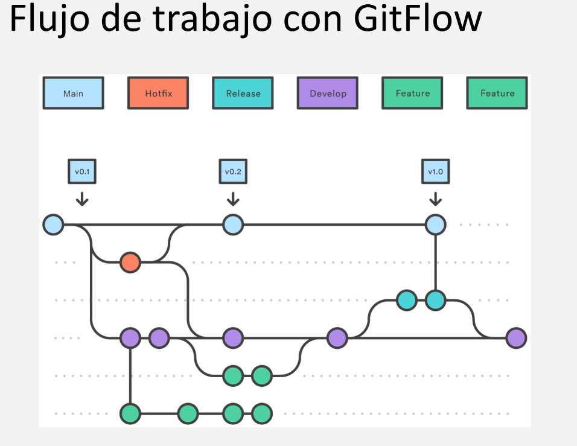

### `git flow init`

Despues de haber iniciado un repositorio local con `git init` y vincularla a nuestro repositorio remoto (con esto tendrás una rama main remota), iniciamos el flujo de trabajo. (enter a todo para dejarlo predeterminado) Despues de hacer eso, habrá creado las ramas que Gitflow utiliza y nos situará en la rama develop

### `git flow feature start nombre_rama`

Este comando creará y te posicionará en una nueva rama que actuará como una feature, la cual se ramifica de develop y es aqui donde podrás realizar tus cambios

Despues e haber realizado el cambio, recuerda siempre realizar un `git add .` y un `git commit`

### `git flow feature finish nombre_rama`

Una vez que hayas terminado de realizar tus cambios y pasarlos con un commit, se aplicará este comando para que fusiones los cambios a la rama `develop` y elimine la rama `feature` en la que estabamos trabajando, luego de hacer esto, nos encontraremos en develop y podremos aplicar un `git push origin develop`

### `git flow release start v1.0.0`

Este comando crea una rama llamada `release` con un tipo de versión, los cambios que se realicen aqui se aplicarán tanto en develop como en main una vez terminado, esto debido a que esta rama asume que el proyecto está en produccion, ya que los cambios en release deben ser cambios como:

-   Corrección de errores menores.
-   Estabilización y validación final.
-   Actualización de metadatos (número de versión, changelog).
-   Pruebas intensivas.
-   Preparación para despliegue.
-   Actualización de documentación.
-   Coordinación con el equipo y stakeholders

Cambios pequeños para actualizar tanto en producción como en desarrollo

### `git flow release finish v1.0.0`

Esto aplicará los cambios tanto en la rama main como en develop y eliminará la release, si no se elimina, puedes hacerlo manualmente con `git branch -D nombre_rama` (aunque eso es algo que no deberia ocurrir), recuerda que los release tambien se debe ramificar desde develop.

Luego aplicamos un push tanto en develop como en main:

- git push origin develop
- git push origin main --tags

>**Nota:** Ten cuidado al momento de usar vim, cuando finalizar el release, te pedirá ciertos mensajes que especifiquen lo que hiciste, esto lo aplicará tnato en main como develop, puede que te aparezca unas 2 o 3 veces, ya que tambien solicita un mensaje para el tag generado(v1.0.0) puedes seguir estas instrucciones:

-   **`i`**: Entrar en modo de inserción.
-   **`Esc`**: Salir del modo de inserción.
-   **`:w`**: Guardar cambios.
-   **`:wq`**: Guardar y salir.
-   **`:q!`**: Salir sin guardar.

Te recimiendo usar `i` para empezar a escribir y luego presiona `Esc` para escribir `:wq` y guardar

### `git flow hotfix start v1.0.1`

La lógica es similar, solo cambia el objetivo, en la rama hotfix se resuelven errores encontrados en producción, es por eso que se ramifica desde la rama `main`

### `git flow hotfix finish v1.0.1 `

Al finalizar los cambios, estos se aplicaran tanto en main como develop, tambien necesitarás especificar algunos mensajes en vim

Luego aplicamos un push tanto en develop como en main:

- git push origin develop
- git push origin main --tags